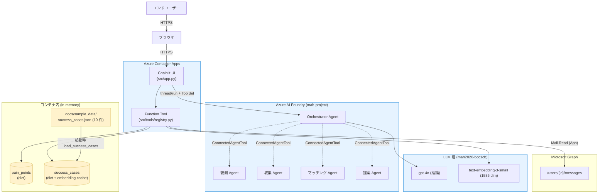
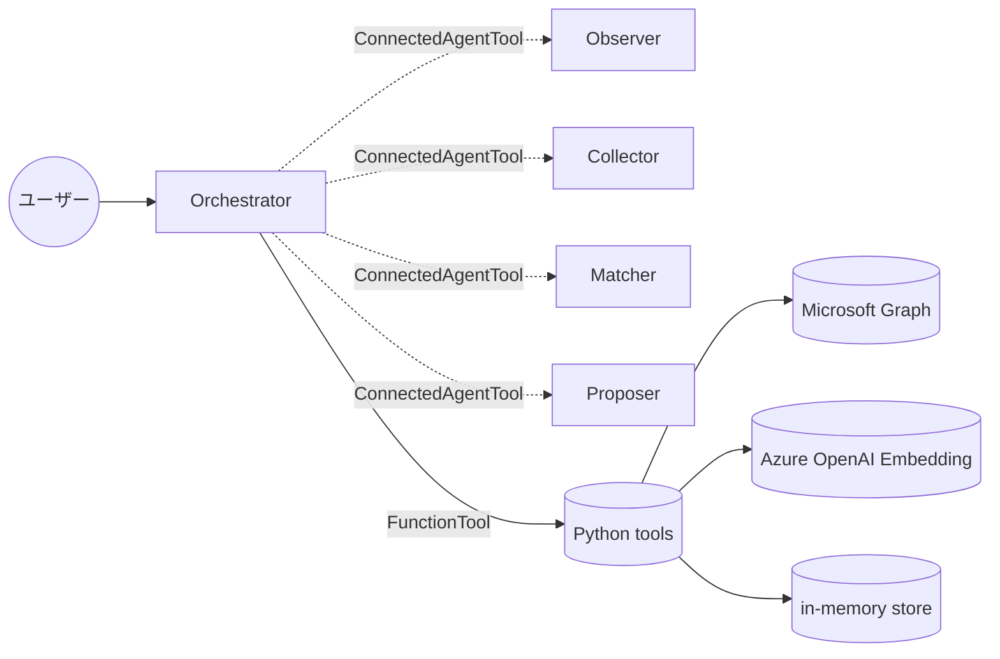
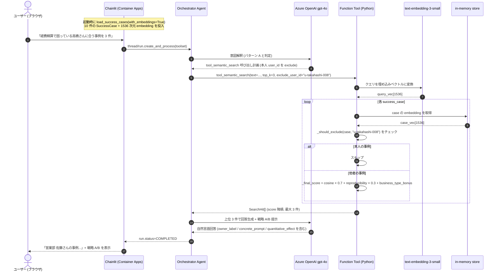
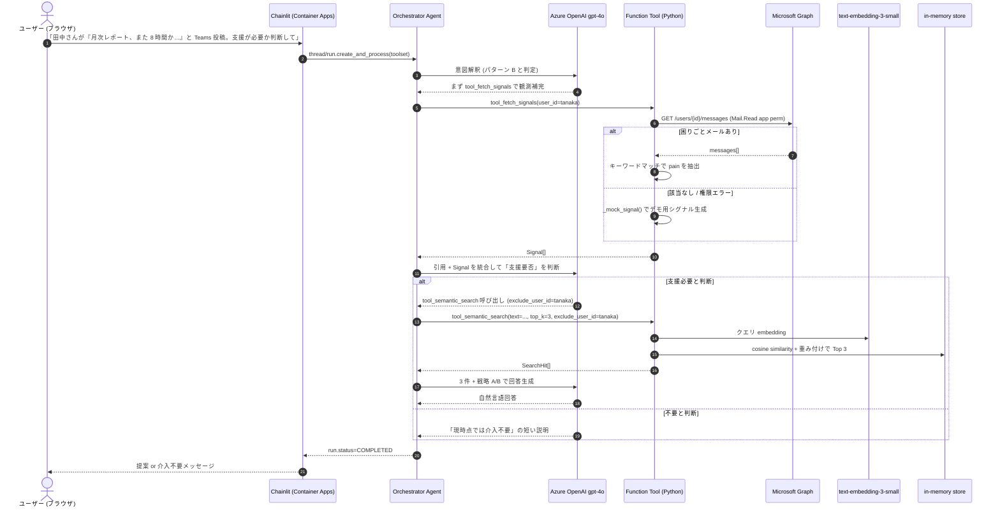
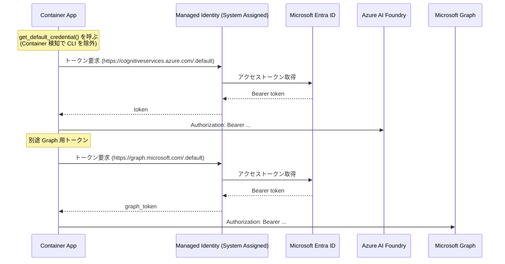
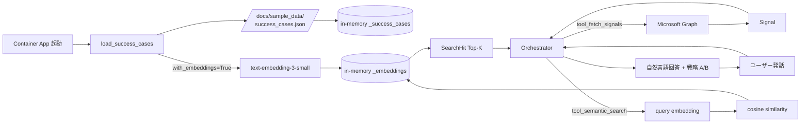

# アーキテクチャ

> Microsoft Agent Hackathon 2026 提出作品: AI 浸透加速エージェント
> 最終更新: 2026-05-26

このドキュメントは現在 main にマージされている実装をベースに記述している。
要件定義は [requirements.md](./requirements.md) を、構築手順は [azure-setup.md](./azure-setup.md) と [operations.md](./operations.md) を参照。

---

## 1. 全体構成



### レイヤー別責務

| 層 | 構成要素 | 責務 |
|---|---|---|
| UI | Chainlit on Container Apps | ブラウザからのチャット入出力 / WebSocket セッション |
| エージェント | Foundry の Orchestrator + 4 子 Agent | 意図解釈と専門タスクへの委譲 (Connected Agents) |
| Function Tool | `src/tools/registry.py` | Foundry から Python 関数として呼ばれる data layer 入口 |
| LLM | gpt-4o / text-embedding-3-small | 推論と embedding 生成 |
| データ | in-memory + JSON seed | success_cases (10 件) と pain_points を保持 |
| 観測 | Microsoft Graph Mail.Read | Outlook メールから困りごとシグナル検知 |

### Azure リソース構成

| 種別 | 名前 | リージョン | 役割 |
|---|---|---|---|
| Resource Group | `rg-mah-2026` | eastus2 | 全リソースの束ね |
| Foundry (Cognitive Services) | `mah2026-bcc1cb` | eastus2 | Agent と LLM の拠点 |
| Foundry Project | `mah-project` | (account 配下) | Agent の論理単位 |
| Model deployment | `gpt-4o` (Standard 50K TPM) | (account 配下) | Orchestrator の推論 |
| Model deployment | `text-embedding-3-small` (Standard 50) | (account 配下) | RAG の embedding |
| ACR | `mahacr551974` | eastus2 | コンテナイメージのレジストリ (Basic) |
| Container Apps Environment | `mah-cae` | eastus2 | Container App 実行環境 |
| Container App | `microsoft-agent-hackathon` | eastus2 | Chainlit UI + Function Tool |

公開 URL: `https://microsoft-agent-hackathon.nicebay-ff60cde9.eastus2.azurecontainerapps.io/`

---

## 2. Multi-Agent 構成



| Agent | NAME | 主な責務 (instructions の核) |
|---|---|---|
| Orchestrator | `orchestrator` | ユーザー対話の窓口。意図解釈し子 Agent を呼び分け、Function Tool で data layer を直接操作 |
| 観測 | `observer` | Microsoft Graph 経由で困りごとシグナルを検知して構造化候補を返す |
| 収集 | `collector` | 候補シグナルを構造化し、本人承認文を生成 |
| マッチング | `matcher` | 困りごとから類似成功事例を embedding 検索し、戦略 A/B を提示 |
| 提案 | `proposer` | 個別最適化されたプロンプト/テンプレを生成 |

### Function Tool (Orchestrator が自律呼び出し)

| Tool | 機能 | データ層への接続 |
|---|---|---|
| `tool_fetch_signals(user_id, since_iso?)` | 困りごとシグナル取得 | Microsoft Graph `/users/{id}/messages` |
| `tool_save_pain_point(user_id, business_context, ...)` | 困りごとを永続化 | in-memory `pain_points` |
| `tool_semantic_search(text, top_k=3)` | 類似成功事例検索 | text-embedding-3-small で cosine similarity |
| `tool_fetch_success_cases(case_ids)` | 成功事例詳細取得 | in-memory `success_cases` |

---

## 3. メインシナリオのシーケンス

Orchestrator が判断する入力パターンは 2 種類ある。どちらも最終的に
「最大 3 件の事例 + 戦略 A/B」というフォーマットに収束する。

### 3.1 パターン A: 能動的な検索依頼

「○○さんに合う事例を探して」のような、検索意図が明確な発話。
Orchestrator は本人 user_id を抽出して **`exclude_user_id`** に渡し、
本人の事例が自己推薦されることを防ぐ。



### 3.2 パターン B: Teams 投稿トリガー (自律判断)

ユーザーが観測情報を引用する発話 (「○○さんが Teams にこう投稿した」)。
Orchestrator は **支援要否を自分で判断** し、必要なら能動的に検索 → 提案まで進める。



### 3.3 スコアリング詳細

`tool_semantic_search` の最終スコア:

```
final_score = (cosine_similarity * SEMANTIC_WEIGHT)        # 0.7
            + (reproducibility_score * REPRODUCIBILITY_WEIGHT)  # 0.3
            + (BUSINESS_TYPE_BONUS if business_type in query else 0)  # +0.2
```

定数はすべて `src/tools/search_query.py` の冒頭にまとめてあり、
チューニングは数値変更だけで完結する。

### 3.4 自律ループの停止条件

- 全テンプレ項目が埋まった
- ユーザーにしか聞けない情報が残り、確認質問を発した
- 同じ Tool を 3 回以上呼んでも進展しない (LLM 側の判断)

---

## 4. 認証フロー



### 付与済み権限 (Managed Identity `cb5e0d0f-...`)

| スコープ | 権限 | 種別 |
|---|---|---|
| Foundry account `mah2026-bcc1cb` | `Cognitive Services User` | Azure RBAC |
| Microsoft Graph | `Mail.Read` | Application permission |
| Microsoft Graph | `User.Read.All` | Application permission |

ローカル開発時は `DefaultAzureCredential` が `az login` の認証情報を使い同じ機能を提供する (`exclude_cli_credential=False`)。

---

## 5. データフロー



### 検索ロジックの優先順位

1. **embedding が 1 件以上登録されていれば**: クエリ embedding と cos similarity でランキング
2. **embedding 未登録 or 取得失敗時**: business_type の文字列マッチへフォールバック
3. **クエリが空文字列**: 即 `[]` を返す

---

## 6. ディレクトリ構成

```
.
├── src/
│   ├── app.py                  Chainlit エントリ + ToolSet 設定
│   ├── config.py               環境変数集約
│   ├── agents/                 5 Agent の NAME/DESCRIPTION/INSTRUCTIONS
│   │   ├── orchestrator.py
│   │   ├── observer.py
│   │   ├── collector.py
│   │   ├── matcher.py
│   │   └── proposer.py
│   └── tools/                  Function Tool 実装 + data layer
│       ├── registry.py         Foundry 用 wrapper (asdict 変換)
│       ├── credential.py       Container / Local 両対応の DefaultAzureCredential
│       ├── cosmos_io.py        pain_points / success_cases (in-memory)
│       ├── embed.py            Azure OpenAI embedding ヘルパー
│       ├── graph_observe.py    Microsoft Graph 経由のメール観測
│       ├── search_query.py     embedding ベース semantic_search
│       └── seed.py             起動時 JSON → in-memory loader
├── scripts/
│   ├── create_agent.py         (legacy) 単一 Agent 作成
│   └── create_agents.py        5 Agent + ConnectedAgentTool 結合
├── tests/                      53 件 (ruff + pyright + pytest)
├── docs/
│   ├── architecture.md         本ドキュメント
│   ├── operations.md           デプロイ・運用手順
│   ├── requirements.md         要件定義書
│   ├── status.md               現状サマリ
│   ├── azure-setup.md          Azure リソース構築手順 (詳細)
│   └── sample_data/
│       └── success_cases.json  ダミー成功事例 10 件 (PII なし)
├── Dockerfile                  Container Apps 用 (multi-stage build)
├── pyproject.toml
└── README.md
```

---

## 7. 既知の制約と前提

| 項目 | 内容 |
|---|---|
| データ永続化 | in-memory dict のみ。Container 再起動でリセット (起動時に JSON から再 seed) |
| マルチユーザー | 単一 Container App で sticky session なし。pain_points は user 間で共有 |
| Microsoft Graph データ | テナント (free.nakashima@gmail.com) に AAD ユーザーが居ないため `_mock_signal()` にフォールバックして動作 |
| Cosmos DB / AI Search | MVP では未使用。`src/tools/cosmos_io.py` / `search_query.py` の差し替え点は明確に分離済み |
| Phase 2 想定 | Cosmos DB へのスワップ、5 グラフ統合 (組織図/コラボ/専門性/負荷/過去案件)、Power Automate での会議自動化、レビューモード |
