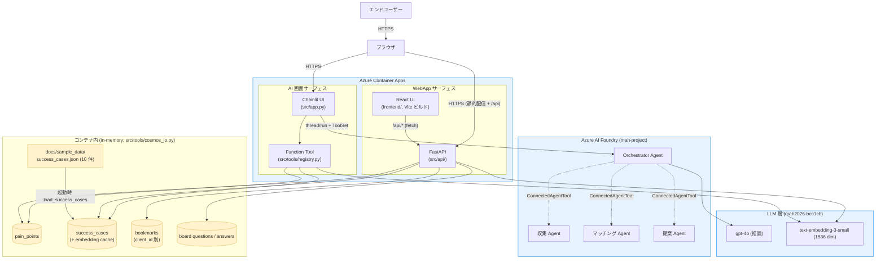
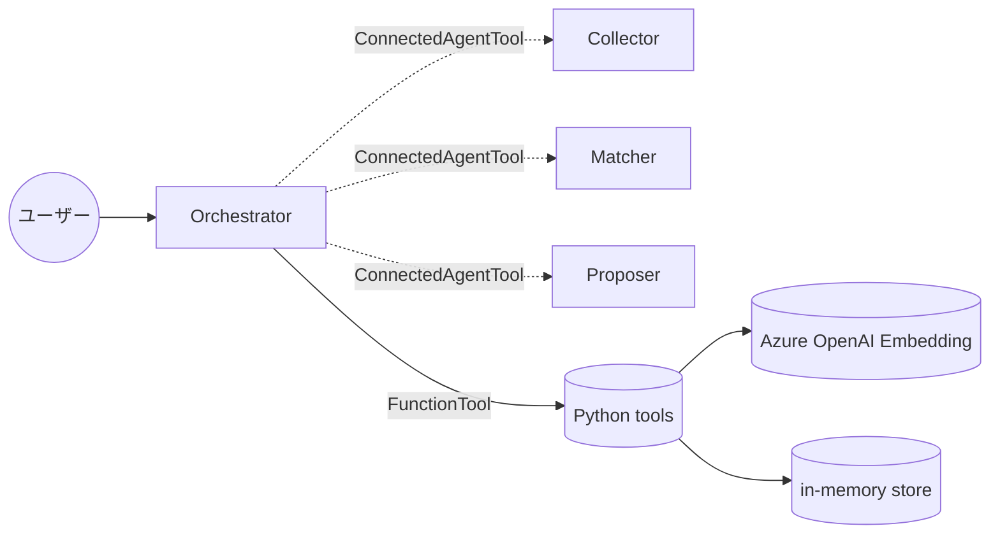
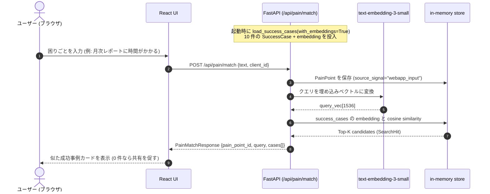
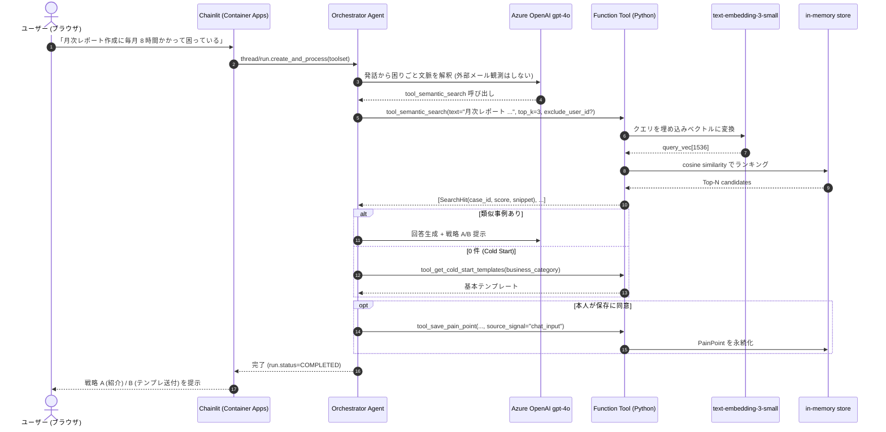
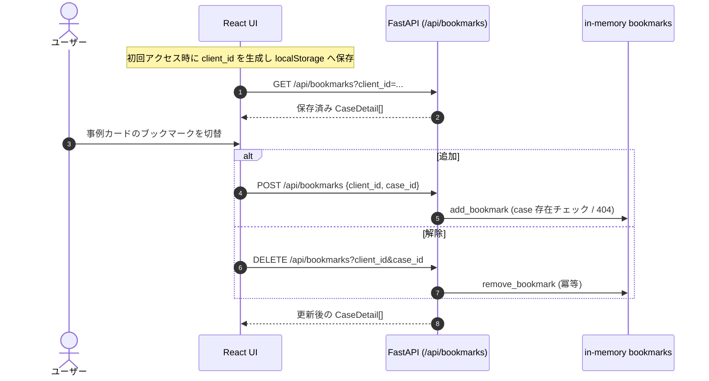
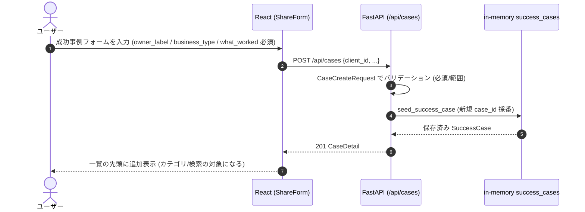
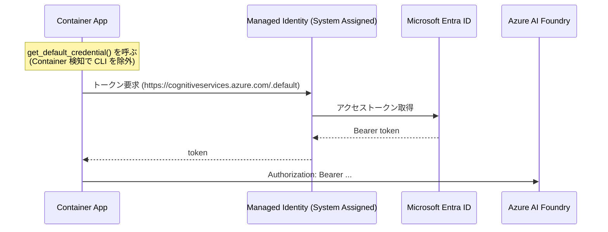
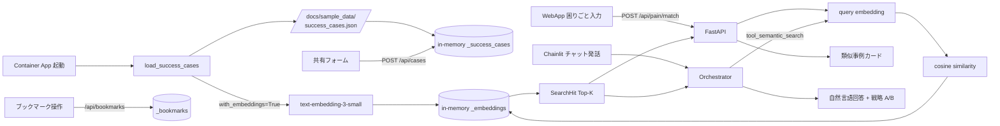

# アーキテクチャ

> Microsoft Agent Hackathon 2026 提出作品: AI 浸透加速エージェント
> 最終更新: 2026-05-29

このドキュメントは現在のブランチにマージ予定の実装をベースに記述している。
要件定義は [requirements.md](./requirements.md) を、構築手順は [azure-setup.md](./azure-setup.md) と [operations.md](./operations.md) を参照。

> メール観測 (Microsoft Graph Mail.Read / observer Agent / fetch_signals) は廃止した。
> 困りごとは **WebApp の入力欄** と **AI 画面 (Chainlit) のチャット発話** から明示的に拾う方式に変更している。

---

## 1. 全体構成

Kodama は 2 つのフロントサーフェスを持ち、両者は同じ in-memory データ層 (`src/tools/`) を共有する。



### レイヤー別責務

| 層 | 構成要素 | 責務 |
|---|---|---|
| WebApp UI | React (frontend/) on Container Apps | 困りごと入力 / カテゴリ閲覧 / 事例登録フォーム / ブックマーク / 掲示板 |
| WebApp API | FastAPI (`src/api/`) | `/api/*` の REST 提供 + Vite ビルド成果物の静的配信 |
| AI 画面 UI | Chainlit (`src/app.py`) on Container Apps | チャット入出力 / WebSocket セッション |
| エージェント | Foundry の Orchestrator + 3 子 Agent | 意図解釈と専門タスクへの委譲 (Connected Agents) |
| Function Tool | `src/tools/registry.py` | Foundry から Python 関数として呼ばれる data layer 入口 |
| LLM | gpt-4o / text-embedding-3-small | 推論と embedding 生成 |
| データ | in-memory + JSON seed (`src/tools/`) | success_cases / pain_points / bookmarks / board を保持。両サーフェスで共有 |

### Azure リソース構成

| 種別 | 名前 | リージョン | 役割 |
|---|---|---|---|
| Resource Group | `rg-mah-2026` | eastus2 | 全リソースの束ね |
| Foundry (Cognitive Services) | `mah2026-bcc1cb` | eastus2 | Agent と LLM の拠点 |
| Foundry Project | `mah-project` | (account 配下) | Agent の論理単位 |
| Model deployment | `gpt-4o` (Standard 50K TPM) | (account 配下) | Orchestrator の推論 |
| Model deployment | `text-embedding-3-small` (Standard 50) | (account 配下) | RAG の embedding |
| ACR | `mahacr551974` | eastus2 | コンテナイメージのレジストリ (Basic) |
| Container Apps Environment | `mah-cae` | eastus2 | Container App 実行環境 |
| Container App | `microsoft-agent-hackathon` | eastus2 | Chainlit UI + FastAPI + Function Tool |

公開 URL: `https://microsoft-agent-hackathon.nicebay-ff60cde9.eastus2.azurecontainerapps.io/`

---

## 2. Multi-Agent 構成



| Agent | NAME | 主な責務 (instructions の核) |
|---|---|---|
| Orchestrator | `orchestrator` | ユーザー対話の窓口。チャット発話から困りごとを解釈し子 Agent を呼び分け、Function Tool で data layer を直接操作 |
| 収集 | `collector` | 困りごとを構造化し、本人承認文を生成 |
| マッチング | `matcher` | 困りごとから類似成功事例を embedding 検索し、戦略 A/B を提示 |
| 提案 | `proposer` | 個別最適化されたプロンプト/テンプレを生成 |

### Function Tool (Orchestrator が自律呼び出し)

| Tool | 機能 | データ層への接続 |
|---|---|---|
| `tool_save_pain_point(user_id, business_context, pain_description, source_signal)` | 本人承認済みの困りごとを永続化。チャット由来は `source_signal="chat_input"` | in-memory `pain_points` |
| `tool_semantic_search(text, top_k=3, exclude_user_id?)` | 類似成功事例検索。本人の事例は `exclude_user_id` で除外 | text-embedding-3-small で cosine similarity |
| `tool_fetch_success_cases(case_ids)` | 成功事例詳細取得 | in-memory `success_cases` |
| `tool_get_cold_start_templates(business_category?)` | 類似事例 0 件 (Cold Start) 時のテンプレート取得 | in-memory `cold_start_templates` |

---

## 3. メインシナリオのシーケンス

困りごとの入力経路は 2 つ。どちらも最終的に `semantic_search` で in-memory の成功事例にマッチングする。

### 3-1. WebApp: 困りごと入力欄 → マッチング



### 3-2. AI 画面 (Chainlit): チャット発話から困りごと検知



### 自律ループの停止条件

- 全テンプレ項目が埋まった
- ユーザーにしか聞けない情報が残り、確認質問を発した
- 同じ Tool を 3 回以上呼んでも進展しない (LLM 側の判断)

---

## 4. その他の WebApp フロー

### 4-1. ブックマーク (サーバー側永続)

ログイン機構を持たないため、ブラウザの `localStorage` に保持する `client_id` を識別子としてサーバー側に保存する。



### 4-2. 成功事例の登録 (共有フォーム)



---

## 5. 認証フロー

メール観測廃止に伴い Microsoft Graph 向けトークンは不要になった。残るのは Foundry / Azure OpenAI 向けの取得のみ。



### 付与済み権限 (Managed Identity)

| スコープ | 権限 | 種別 |
|---|---|---|
| Foundry account `mah2026-bcc1cb` | `Cognitive Services User` | Azure RBAC |

ローカル開発時は `DefaultAzureCredential` が `az login` の認証情報を使い同じ機能を提供する (`exclude_cli_credential=False`)。

---

## 6. データフロー



### 検索ロジックの優先順位

1. **embedding が 1 件以上登録されていれば**: クエリ embedding と cos similarity でランキング
2. **embedding 未登録 or 取得失敗時**: business_type の文字列マッチへフォールバック
3. **クエリが空文字列**: 即 `[]` を返す

---

## 7. ディレクトリ構成

```
.
├── src/
│   ├── app.py                  Chainlit エントリ + ToolSet 設定
│   ├── config.py               環境変数集約
│   ├── agents/                 4 Agent の NAME/DESCRIPTION/INSTRUCTIONS
│   │   ├── orchestrator.py
│   │   ├── collector.py
│   │   ├── matcher.py
│   │   └── proposer.py
│   ├── api/                    FastAPI (WebApp サーフェス)
│   │   ├── main.py             アプリ生成 + ルーター結合 + 静的配信
│   │   ├── schemas.py          Pydantic スキーマ + 変換ヘルパー
│   │   ├── employee.py         categories / today (社員)
│   │   ├── pain.py             pain/match (困りごとマッチング)
│   │   ├── bookmarks.py        bookmarks GET/POST/DELETE
│   │   ├── cases.py            成功事例の登録 POST
│   │   ├── admin.py            メンバー支援 / 戦略実行 (管理者)
│   │   └── board.py            困りごと掲示板
│   └── tools/                  Function Tool 実装 + data layer
│       ├── registry.py         Foundry 用 wrapper (asdict 変換)
│       ├── credential.py       Container / Local 両対応の DefaultAzureCredential
│       ├── cosmos_io.py        pain_points / success_cases / bookmarks (in-memory)
│       ├── embed.py            Azure OpenAI embedding ヘルパー
│       ├── search_query.py     embedding ベース semantic_search
│       └── seed.py             起動時 JSON → in-memory loader
├── frontend/                   React + Vite (WebApp UI)
│   └── src/
│       ├── App.tsx             画面全体の構成
│       ├── components/         PainInput / ShareForm / CaseCard / BoardSection など
│       ├── hooks/              useClientId / useLocalStorageJson
│       ├── lib/api.ts          /api クライアント (fetch ラッパー)
│       └── types/api.ts        FastAPI レスポンスに対応する型
├── scripts/
│   ├── create_agent.py         (legacy) 単一 Agent 作成
│   └── create_agents.py        4 Agent + ConnectedAgentTool 結合
├── tests/                      ruff + pyright + pytest
├── docs/
│   ├── architecture.md         本ドキュメント
│   ├── operations.md           デプロイ・運用手順
│   ├── requirements.md         要件定義書
│   ├── status.md               現状サマリ
│   ├── azure-setup.md          Azure リソース構築手順 (詳細)
│   └── sample_data/
│       └── success_cases.json  ダミー成功事例 10 件 (PII なし)
├── Dockerfile                  Container Apps 用 (multi-stage build)
├── pyproject.toml
└── README.md
```

---

## 8. 既知の制約と前提

| 項目 | 内容 |
|---|---|
| データ永続化 | in-memory dict のみ。Container 再起動でリセット (起動時に JSON から再 seed)。bookmarks / 登録事例も再起動で消える |
| マルチユーザー | 単一 Container App で sticky session なし。pain_points / success_cases は user 間で共有 |
| 利用者識別 | WebApp はログイン機構なし。`localStorage` の `client_id` でブックマーク/登録者を区別する (匿名前提) |
| 困りごと検知 | メール観測 (Microsoft Graph) は廃止。WebApp 入力欄と Chainlit チャット発話からのみ拾う |
| Cosmos DB / AI Search | MVP では未使用。`src/tools/cosmos_io.py` / `search_query.py` の差し替え点は明確に分離済み |
| Phase 2 想定 | Cosmos DB へのスワップ、5 グラフ統合 (組織図/コラボ/専門性/負荷/過去案件)、Power Automate での会議自動化、レビューモード |
```
