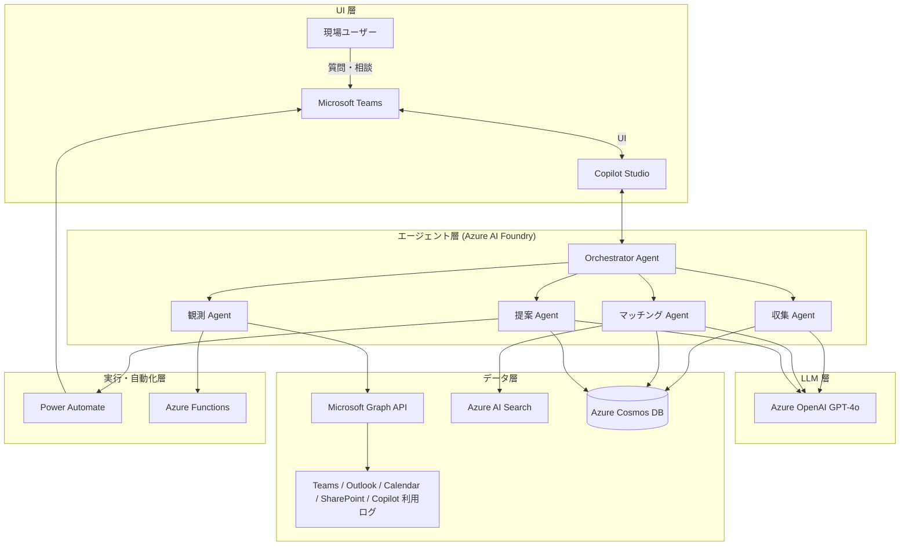
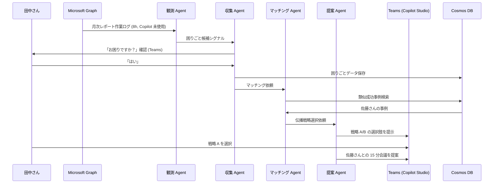

# 要件定義書: AI 浸透加速エージェント

> Microsoft Agent Hackathon 2026 提出物の要件定義。プロトタイプとして「動くデモ」と「コンセプトの提示」を目的とする。

## 0. ドキュメント情報

| 項目     | 内容                    |
| -------- | ----------------------- |
| 版       | v1.0 (ハッカソン提出版) |
| 作成日   | 2026-05-23              |
| 提出締切 | 2026-06-01 (月) 23:59   |
| 最終審査 | 2026-06-18 (木)         |

---

## 1. プロジェクト概要

### 1.1 解決する課題

社内に Microsoft Copilot 等の AI ツールは導入されているが、**現場で使いこなせている人が少なく、業務改革に繋がっていない**。

具体的な現場の状況:

- 隣の部署で同じ業務を AI で半分の時間にしている人がいるのに、お互い知らない
- AI を「触ってみたが何に使うか分からない」状態で止まる人が多い
- 情報シスが個別の問い合わせ対応に追われ、戦略業務に集中できない

### 1.2 提案するソリューション

**「AI 浸透加速エージェント」**: Microsoft Graph で組織活動を観測し、業務の困りごとと成功事例をマッチングして自動で紹介する自律エージェント。

実現する 2 つの動作:

1. **AI で業務改革に成功した人 (成功者) の事例を、組織内に蓄積する**
2. **同じ業務の困りごとを持つ別の人を検知したら、成功者の事例を自動で紹介する**

### 1.2.1 AI 導入成熟度フェーズ
■ Phase0（AI導入前）
- AI活用しやすそうな業務を分類
- 初期テンプレ作成
- 成功事例登録フォーム準備

■ Phase1（AI導入直後）
- テンプレから、AI業務活用方法を提案

■ Phase2（AI活用が一部できてきたとき）1~3ヶ月後？ここが一番美味しい時期かも
- 同じ会社の誰かの成功事例を共有

■ Phase3（AI浸透期）
- AI活用ナレッジの蓄積・検索基盤へ

これにより「AI ライセンスは導入されたが使われない」状態から「困った時に同僚の成功パターンが届く」状態へ遷移させる。

### 1.3 提供価値 (定性)

| 利用者         | 受け取る価値                                                       |
| -------------- | ------------------------------------------------------------------ |
| 困っている社員 | 「いまさら聞きにくい」を超えて、同僚の成功パターンが文脈付きで届く |
| 成功者         | 自分のノウハウが労力なく他者に届き、組織知として残る               |
| DX 推進担当者  | 個別対応の一次受けを自動化し、戦略業務に集中できる                 |
| 管理職         | 部署内の AI 活用状況を把握し、伝播を促進できる                     |

### 1.4 ハッカソン要件への対応

| 要件                                                       | 本プロジェクトの該当                                                                  |
| ---------------------------------------------------------- | ------------------------------------------------------------------------------------- |
| Microsoft Azure アプリケーション実行基盤 or Copilot Studio | Azure Container Apps + Copilot Studio (両方使用)                                      |
| Microsoft AI 技術の使用                                    | Azure AI Foundry Agent Service (Multi-Agent Orchestration) + Azure OpenAI (GPT-4o 系) |
| Agentic AI の要素                                          | LLM が自律的に判断する 5 つの判断分岐 (§3.6)                                          |
| 業務改革                                                   | DX 推進部の "教育・展開" 業務プロセスの自動化と組織知の継続蓄積                       |

### 1.5 スコープ (プロトタイプ範囲)

| 区分           | 内容                                                                                                 |
| -------------- | ---------------------------------------------------------------------------------------------------- |
| 対象業務       | 「月次レポート作成」1 業務に絞ってデモする                                                           |
| 対象ユーザー   | Microsoft 365 ライセンス保有者のうちオプトインした社員 (デモは数名規模を想定)                        |
| 対象 AI ツール | Microsoft Copilot (M365)                                                                             |
| 対象外         | 業務外コミュニケーションの観測、Microsoft 製品以外の AI ツール、社外メンバーへの伝播、多テナント対応 |

---

## 2. デモシナリオ

要件のコアであり審査向けの主要アピール。MVP は以下のシナリオが動作することを目指す。

### 2.1 メインシナリオ: 困りごと → 成功者の紹介

| Step | ユーザー / 場面                                                  | エージェントの動作                                                          |
| ---- | ---------------------------------------------------------------- | --------------------------------------------------------------------------- |
| 1    | 経理部 田中さんが Teams で「月次レポート、また 8 時間か…」と発言 | 観測 Agent が困りごとシグナルを検知                                         |
| 2    | -                                                                | 収集 Agent が Teams で「月次レポート作業、お困りですか？」と本人確認        |
| 3    | 田中さんが「はい」と回答                                         | マッチング Agent が `success_cases` を検索し、営業部 佐藤さんの事例を発見   |
| 4    | -                                                                | 提案 Agent が戦略 A (直接紹介) と戦略 B (テンプレ送付) の選択肢を提示       |
| 5    | 田中さんが戦略 A を選択                                          | Power Automate が双方の Calendar を確認し 15 分相談の会議を自動セット       |
| 6    | 15 分相談実施                                                    | 佐藤さんがプロンプトとテンプレを共有                                        |
| 7    | 田中さんが翌月レポートを 2.5h で完了                             | (Phase 2) F-2 が新成功事例として検知し、本人承認後に `success_cases` に追加 |

### 2.2 サブシナリオ: 成功事例の手動登録 (MVP)

| Step | 場面                        | 動作                                                  |
| ---- | --------------------------- | ----------------------------------------------------- |
| 1    | DX 推進部が事例フォーム入力 | 業務種別・成功要因・使用プロンプトを入力              |
| 2    | -                           | Cosmos DB `success_cases` に保存                      |
| 3    | -                           | Azure AI Search に embedding が登録され検索可能になる |

### 2.3 サブシナリオ: Cold Start 時のテンプレ提案 (MVP)

| Step | 場面                                            | 動作                                                                         |
| ---- | ----------------------------------------------- | ---------------------------------------------------------------------------- |
| 1    | 田中さんの困りごとを検知したが、類似成功事例が 0 件 | 提案 Agent が「成功事例未登録」と判断                                        |
| 2    | -                                               | 月次レポート向けテンプレプロンプト + チェックリストを Teams で提示           |
| 3    | 田中さんがテンプレを使って作業を短縮             | DX 推進部が結果を確認し、成功事例フォームへの登録を促して知識蓄積へ接続する |

### 2.4 デモで見せる Before / After (例示値)

実運用 KPI ではなく、デモシナリオの**動作確認用の期待値**として記載。

| 指標                            | Before          | After (デモ時の想定) |
| ------------------------------- | --------------- | -------------------- |
| 田中さんの月次レポート時間      | 8h/月           | 2.5h/月              |
| 田中さんの Copilot 利用回数     | 3 回 (半年累計) | 月 47 回             |
| 経理部 5 名の月次レポート総時間 | 40h             | 12.5h                |

---

## 3. 機能要件

### 3.1 機能一覧 (MVP)

| 機能 ID | 機能名                 | 入力                                                    | 処理                                                 | 出力                                                            |
| ------- | ---------------------- | ------------------------------------------------------- | ---------------------------------------------------- | --------------------------------------------------------------- |
| F-1     | 困りごと検知           | Teams 投稿、Outlook メール、Copilot 利用ログ (MS Graph) | LLM が「困っている兆候」を検知し、本人確認後に構造化 | 構造化された困りごとデータ (誰が、いつ、何の業務で、何に困った) |
| F-2     | 成功事例の収集         | 手動入力フォーム (MVP) / Phase 2 で能動検知化           | 成功要因を抽出・一般化                               | 成功事例データ (誰が、何の業務で、どう解決したか)               |
| F-3     | マッチングと伝播       | 困りごとデータ + 成功事例 DB                             | embedding 類似度で候補抽出 + 伝播戦略選択 (LLM)      | Teams 通知 / 会議自動セット                                     |
| F-4     | 個別ソリューション提案 | 社員プロファイル + 過去 AI 利用履歴                     | 事例 DB から最適化された解決パターンを生成           | 具体的プロンプト / テンプレート / 相談相手レコメンド            |
| F-5     | 簡易ダッシュボード     | Cosmos DB の蓄積データ                                  | 件数・採用率を集計                                   | 利用率、提案数、採用率の簡易表示                                |

### 3.2 MVP 受け入れ基準 (DoD)

ハッカソン審査時にデモで示せる状態を「実装完了」とする。

| 機能 ID | デモで示せること                                                       |
| ------- | ---------------------------------------------------------------------- |
| F-1     | Teams 投稿から困りごと候補を検知し、本人確認メッセージを送信できる     |
| F-2     | 成功事例を手動登録し、検索可能な形で保存できる                         |
| F-3     | 困りごと 1 件に対し関連成功事例を提示し、戦略 A/B の選択肢を提示できる |
| F-4     | 「月次レポート作成」向けに、成功者のプロンプトを Teams で提示できる    |
| F-5     | 提案数・採用率の簡易表示が画面に出る                                   |

### 3.3 F-1: 困りごと検知

**検知シグナル (LLM 判定):**

1. 「これどうやって」「分からない」等の質問的メッセージ
2. Copilot を使い始めて途中で止めた痕跡 (セッションログ)
3. 繰り返し非効率作業のパターン (同じ操作を毎月手作業)

**処理ロジック:**

```
[Step 1] Microsoft Graph から観測対象データを取得 (オプトイン者のみ)
[Step 2] LLM (GPT-4o 系) でシグナル該当性を判定
[Step 3] 該当の場合、本人に Teams で確認
   「○○の作業、お困りではないですか？」
[Step 4] 本人承認を得た場合、Cosmos DB に構造化保存
```

### 3.4 F-2: 成功事例の収集 (MVP は手動)

**MVP: 手動フォーム入力**

DX 推進部または成功者本人が以下を入力:

- 業務種別 (例: 月次レポート作成)
- 成功要因 (使ったプロンプト・手順・参考資料)
- 再現可能性メモ (本人スキル依存度の自己申告)

**Phase 2: 能動検知化**

- 通常より短時間で完了したタスク (Calendar ログから推定)
- Copilot 利用と成果物品質の組み合わせ
- 「これ便利」等の Teams 発信を検知

### 3.5 F-3: マッチングと伝播

**Hybrid 構成: 決定論で候補を絞り、LLM が最終選択する。**

**Step 1. 候補抽出 (MVP の決定論):**

- `pain_points.business_context` を embedding 化し、`success_cases` から類似度 Top-N を取得
- MVP は実装リスクを下げるため、組織関係グラフ (公式組織図・コラボ頻度・負荷推定) は使用しない
- 必要に応じて同一部署フィルタのみ適用可能 (Entra ID の最小属性参照)

**Step 2. 伝播戦略選択 (LLM):**

| 戦略 ID | 内容                             | MVP 対応 |
| ------- | -------------------------------- | -------- |
| A       | 成功者本人から直接紹介           | 対応     |
| B       | テンプレ化して配信               | 対応     |
| C       | 成功者を講師にミニ勉強会         | Phase 2  |
| D       | Just-in-time 提示 (作業中に通知) | Phase 2  |

**補足:**

- 多要素スコアリング式 (コラボ頻度・負荷・成功率の重み付け) は MVP では採用せず、Phase 2 の最適化項目として扱う

### 3.6 自律ループ (Agentic AI の要素)

LLM ベースで以下 5 つの判断を実行する。Multi-Agent Orchestration を Azure AI Foundry で実装する。

| 判断             | 該当機能  | 内容                                                   |
| ---------------- | --------- | ------------------------------------------------------ |
| 兆候検知         | F-1, F-2  | 観測データから「困りごと」「成功事例」を文脈解釈で識別 |
| 成功要因の一般化 | F-2       | 何が効いて、何が偶然かを判別                           |
| マッチング       | F-3       | 候補から最終ペアを選ぶ                                 |
| 伝播戦略選択     | F-3       | 状況に応じて戦略 A/B (Phase 2 は A〜D) から選ぶ        |
| 学習更新         | (Phase 2) | 伝播の有効性を評価し、次回戦略選択の重みを更新する     |

### 3.7 異常系・主要フォールバック

審査時のデモで詰まりやすい箇所と回避策を明示する。

| シナリオ                            | 期待動作                                               |
| ----------------------------------- | ------------------------------------------------------ |
| 本人確認に応答がない                | 24h で候補を破棄し永続化しない                         |
| 本人が「困っていない」と回答        | 永続化せず、同種シグナルを 7 日間抑制                  |
| 成功者が紹介依頼を辞退              | 次点候補で戦略を再選択                                 |
| LLM 呼び出しエラー                  | 3 回までリトライ。失敗時は介入をスキップしてログ記録   |
| Microsoft Graph スロットリング      | バックオフ + キャッシュ。観測頻度は 5 分間隔を上限     |
| Power Automate の会議設定失敗       | 手動候補日時の確認フローへフォールバック               |
| デモ環境で本番 Graph が使えない場合 | モックデータでデモ動作可能なフォールバックモードを用意 |

### 3.8 Human-in-the-Loop 境界

| 操作                       | 自動 / 確認必須                  |
| -------------------------- | -------------------------------- |
| 観測データの取得           | 自動 (オプトイン同意済みのみ)    |
| LLM による兆候判定         | 自動                             |
| `pain_points` への永続化   | **本人承認必須**                 |
| `success_cases` への永続化 | **本人承認必須**                 |
| 紹介通知の送信             | 自動                             |
| 成功者への紹介打診         | **成功者の明示的同意必須**       |
| 会議の自動設定             | **困り手・成功者双方の同意必須** |

---

## 4. 非機能要件 (プロトタイプ範囲)

### 4.1 性能

| 指標                                 | 要件                    |
| ------------------------------------ | ----------------------- |
| エージェントの応答時間 (対話 UI)     | p50 ≤ 3 秒 / p95 ≤ 8 秒 |
| 観測ループの遅延 (Graph 取得 → 判定) | p95 ≤ 5 分              |
| マッチング処理時間                   | p95 ≤ 10 秒             |

### 4.2 プライバシー (本プロジェクトの最重要要件)

ハッカソンであっても、本人観測を扱う以上は最低限の原則を要件化する。

| 項目         | 要件                                                                             |
| ------------ | -------------------------------------------------------------------------------- |
| オプトイン   | 観測対象は本人が明示的に同意したユーザーのみ                                     |
| 透明性       | 「何を観測しているか」を Teams 上で常時確認可能                                  |
| 本人承認原則 | 困りごと・成功事例の組織知化は必ず本人承認後                                     |
| 削除権       | 本人が削除申請可能。`pain_points` は即時、`success_cases` は本人 ID 匿名化で対応 |
| データ最小化 | 観測対象は MVP では Teams 投稿 + Copilot 利用ログに限定                          |

### 4.3 セキュリティ (最低限)

| 項目             | 要件                                                    |
| ---------------- | ------------------------------------------------------- |
| 認証             | Microsoft Entra ID SSO                                  |
| 認可             | RBAC。`success_cases` の登録権限は明示同意ユーザーのみ  |
| データ暗号化     | 保存時 (Cosmos DB)・転送時 (TLS 1.2+) 共に暗号化        |
| シークレット管理 | Azure Key Vault + Managed Identity (環境変数に書かない) |

---

## 5. 技術スタックとアーキテクチャ

### 5.1 採用技術と選定理由

| 区分             | 採用技術                                                 | 選定理由                                                          |
| ---------------- | -------------------------------------------------------- | ----------------------------------------------------------------- |
| 実行基盤         | Azure Container Apps + Azure Functions                   | サーバーレス + 水平スケール。Functions はイベント駆動の観測に最適 |
| エージェント基盤 | Azure AI Foundry Agent Service                           | Multi-Agent Orchestration をローコードで構築できる                |
| LLM              | Azure OpenAI (GPT-4o 系)                                 | 5 つの判断分岐すべての推論に使用                                  |
| 対話 UI          | Microsoft Teams + Copilot Studio                         | 社員の日常導線。ローコードで対話画面を構築できる                  |
| データ           | Azure Cosmos DB (NoSQL) + Azure AI Search (ベクトル検索) | スキーマ柔軟性 + 成功事例のセマンティック検索                     |
| 観測元           | Microsoft Graph API                                      | M365 全データへの統一インターフェース                             |
| 自動化           | Power Automate                                           | 会議自動セットをローコードで実装                                  |
| 認証             | Microsoft Entra ID                                       | M365 と統合 SSO                                                   |

**「Copilot Studio (顔) + Azure AI Foundry (頭脳)」を組み合わせる構成が、本プロジェクトの技術的アピール点。**

### 5.2 レイヤー構成

```
[UI 層]
  Microsoft Teams (Copilot Studio で構築されたチャットインターフェース)

[エージェント層: Multi-Agent Orchestration on Azure AI Foundry]
   ├─ 観測 Agent (Microsoft Graph 経由の継続観測)
   ├─ 収集 Agent (困りごと / 成功事例の構造化抽出)
   ├─ マッチング Agent (誰と誰を繋ぐか)
   ├─ 提案 Agent (個別ソリューション生成)
   └─ オーケストレーター (全体制御)

[LLM 層]
  Azure OpenAI Service (GPT-4o 系)

[データ層]
  - Microsoft Graph API (Teams / Outlook / Calendar / SharePoint / Copilot 利用ログ)
  - Azure AI Search (セマンティック検索)
  - Azure Cosmos DB (蓄積した事例とエージェントメモリ)

[実行・自動化層]
  Power Automate (会議自動セット、通知)
  Azure Functions (イベントトリガ)
```

### 5.3 全体構成図



### 5.4 メインシナリオのシーケンス



---

## 6. データ要件

### 6.1 Cosmos DB コンテナ設計

| コンテナ名      | パーティションキー | 主なフィールド                                                                           |
| --------------- | ------------------ | ---------------------------------------------------------------------------------------- |
| `pain_points`   | `/user_id`         | id, user_id, timestamp, business_context, pain_description, source_signal, status        |
| `success_cases` | `/business_type`   | id, user_id, business_type, what_worked, why_worked, reproducibility_score, embedding_id |
| `match_history` | `/pain_id`         | pain_id, success_id, score, strategy, accepted, outcome                                  |
| `user_settings` | `/user_id`         | user_id, opt_in_status, observe_scopes, notification_prefs                               |

### 6.2 永続化ポリシー

- 観測フェーズの一次キャッシュはメモリのみ。本人未承認データは Cosmos DB に永続化しない。
- 承認後に `pain_points` / `success_cases` に保存。`success_cases` は Azure AI Search の embedding 索引にも登録。
- PII (氏名・メール) は表示時にのみ Graph から取得し、DB に永続化しない。`user_id` は内部 ID で運用。

---

## 7. 外部システム連携

### 7.1 Microsoft Graph API

| 利用エンドポイント                   | 用途                                   | 必要権限                         |
| ------------------------------------ | -------------------------------------- | -------------------------------- |
| `/me/messages`                       | Outlook メールから困りごとシグナル検知 | `Mail.Read` (delegated)          |
| `/me/chats/{id}/messages`            | Teams チャットから検知                 | `Chat.Read` (delegated)          |
| `/me/calendar/events`                | Calendar から作業時間・負荷推定        | `Calendars.Read` (delegated)     |
| `/me/drive/items`                    | SharePoint 文書から作業推定            | `Files.Read.All` (delegated)     |
| `/users/{id}`                        | 組織図情報取得                         | `User.Read.All` (application)    |
| `/reports/microsoft365CopilotUsage*` | Copilot 利用ログ取得                   | `Reports.Read.All` (application) |

### 7.2 Microsoft AI / Power Platform

| サービス                       | 用途                                            |
| ------------------------------ | ----------------------------------------------- |
| Azure AI Foundry Agent Service | Multi-Agent Orchestration、Thread / Run 管理    |
| Azure OpenAI (GPT-4o 系)       | LLM 判断分岐すべての推論                        |
| Azure AI Search                | 成功事例のセマンティック検索 (embedding ベース) |
| Copilot Studio                 | Teams 上の対話 UI 構築                          |
| Power Automate                 | 会議自動セット、通知配信                        |

---

## 8. ハッカソン審査向けアピールポイント

審査軸 (業務改革・Agentic AI・Microsoft 技術活用) への対応を明示する。

### 8.1 業務改革の本質

「AI ツールの導入」ではなく「**AI 活用を組織に伝播させる業務プロセスそのものの設計**」を提案している。DX 推進部の "教育・展開" 業務を AI で代替する。

### 8.2 Agentic AI 要素

- 観測・抽出・マッチング・提案・学習の **5 種類の Agent が協調動作**する Multi-Agent 構成
- すべての判断が LLM ベースの**文脈解釈**で行われる (固定 IF-THEN ルールではない)
- ユーザーの応答や成果を観測して**戦略選択の重みを更新**する自律ループ (Phase 2)

### 8.3 Microsoft 技術スタックの統合的活用

| 技術             | 役割                |
| ---------------- | ------------------- |
| Copilot Studio   | ユーザー対話の "顔" |
| Azure AI Foundry | 自律判断の "頭脳"   |
| Microsoft Graph  | 組織活動の "感覚器" |
| Azure OpenAI     | 思考エンジン        |
| Power Automate   | 行動の "手足"       |

複数の Microsoft 製品を**個別ではなく統合的に活用**する実装パターンを示すことが技術的差別化点。

### 8.4 既存ツールとの差別化

| 観点       | 既存 (Copilot 単体 / Glean 等) | 本プロジェクト                |
| ---------- | ------------------------------ | ----------------------------- |
| 動作モデル | リアクティブ (聞かれて答える)  | プロアクティブ (観測して動く) |
| 単位       | 個人タスク                     | 組織全体の知識伝播            |
| 出力       | 答え / 検索結果                | 「誰と話せ」「これを試せ」    |
| 知識源     | 訓練データ + 既存文書          | 組織内のリアルタイム経験      |

---

## 9. リスクと対策 (ハッカソン版)

| リスク                                    | 影響度 | 対策                                                                              |
| ----------------------------------------- | ------ | --------------------------------------------------------------------------------- |
| プライバシー懸念で審査員に刺さる          | 高     | §4.2 のオプトイン・本人承認・削除権を要件化。デモでも本人確認ステップを必ず見せる |
| Cold start (成功事例不足でデモが映えない) | 高     | デモ用に成功事例を手動で 5 件以上事前投入する                                     |
| LLM 出力のバラつきで本番デモが不安定      | 高     | 重要な発話はモック応答を併用可能にしておく。本番直前にプロンプトを最終調整        |
| Microsoft Graph 権限取得の手間            | 中     | 検証環境は数名のオプトイン取得で開始。デモ環境では Sandbox / モックを併用         |
| デモで Teams 連携が動かない               | 高     | デモシナリオを 3-5 分の録画動画にもしておき、ライブ失敗時にフォールバック         |
| 開発期間不足 (6/1 提出)                   | 高     | §10 の実装順序を厳守。優先度低い機能は Phase 2 構想として説明だけする             |

---

## 10. 実装計画

### 10.1 提出までのスケジュール

| 期間                | 内容                                               |
| ------------------- | -------------------------------------------------- |
| 〜 2026-05-23 (済)  | 要件定義、アーキテクチャ確定                       |
| 2026-05-24 〜 05-29 | MVP 実装 (§10.2 の順序で進める)                    |
| 2026-05-30 〜 05-31 | 動作確認、デモ調整、エンドツーエンドテスト         |
| 2026-06-01          | Zenn 記事執筆完了、デモ動画作成、GitHub 整理、応募 |
| 2026-06-02 〜 06-09 | 一次審査期間                                       |
| 2026-06-10 〜 06-17 | (進出時) ピッチ準備、Phase 2 機能の追加実装        |
| 2026-06-18          | 最終審査会・表彰式                                 |

### 10.2 実装順序 (MVP マイルストーン)

下位は上位の動作を前提とするため、原則として上から順に着手する。

| 順序 | マイルストーン                                 | 完了の目安                                              |
| ---- | ---------------------------------------------- | ------------------------------------------------------- |
| 1    | Copilot Studio + Teams 基本対話の疎通          | Teams からエージェントに発話し応答が返る                |
| 2    | Cosmos DB スキーマ整備 + 成功事例の手動入力 UI | §6.1 のコンテナが作成され、`success_cases` に登録できる |
| 3    | Microsoft Graph 観測 (Teams 投稿のみ)          | オプトイン者の Teams 投稿を取得しキャッシュできる       |
| 4    | LLM 判定 (困りごと検知 + 関連事例検索)         | F-1 と F-3 の DoD を満たす                              |
| 5    | Teams 通知 (戦略 A/B の提示)                   | F-3 の戦略提案が Teams に届く                           |
| 6    | Power Automate での会議自動セット              | 戦略 A 採用時に会議が自動作成される                     |
| 7    | 簡易ダッシュボード                             | F-5 の DoD を満たす                                     |

---

## 11. Phase 2 構想 (参考・審査向け将来展開)

ハッカソン提出後の発展構想。MVP には含まれない。

| 強化項目       | 内容                                                |
| -------------- | --------------------------------------------------- |
| F-2 能動検知化 | 利用ログ・成果物品質シグナルから成功事例を自動検知  |
| マッチング     | コラボグラフ・負荷グラフを追加し 4 グラフ統合に拡張 |
| 学習ループ     | 戦略選択ロジックの自律更新を実装                    |
| ダッシュボード | Power BI 本格版 (KPI 6 種すべて表示)                |
| 業務タイプ     | 月次レポート以外に提案書作成・議事録要約等を追加    |
| 中長期展開     | 業務手順改定・新規制対応・営業ノウハウ伝播等に応用  |

---

## 12. 提出物

ハッカソン応募で必要な提出物。

| 提出物                | 内容                                                    |
| --------------------- | ------------------------------------------------------- |
| 成果物の URL          | Copilot Studio 共有 URL または Web アプリ               |
| Zenn ブログ記事       | プロジェクト解説記事 (アーキテクチャ + デモ + 設計思想) |
| GitHub リポジトリ URL | ソースコード + ドキュメント (任意)                      |
| デモ動画 (任意)       | §2 シナリオを 3-5 分で再現                              |

---

## 付録 A: 用語集

| 用語                      | 定義                                                                 |
| ------------------------- | -------------------------------------------------------------------- |
| Agentic AI                | LLM がツール実行・観測・判断を自律的に繰り返すループ型 AI            |
| Multi-Agent Orchestration | 複数の専門 Agent を協調動作させる構成                                |
| Just-in-time 提示         | 作業中のリアルタイム状況に応じて最適タイミングで情報を届ける手法     |
| Human-in-the-Loop         | 自律エージェントの判断に人の確認を組み込む設計                       |
| オプトイン                | 観測対象に含まれるためには本人が明示的に同意する必要があるという原則 |

---

## 付録 B: 参考リンク

- [Microsoft Agent Hackathon 2026 公式](https://zenn.dev/hackathons/microsoft-agent-hackathon-2026)
- [Azure AI Foundry Agent Service](https://learn.microsoft.com/azure/ai-services/agents/)
- [Microsoft Graph API](https://learn.microsoft.com/graph/)
- [Copilot Studio](https://learn.microsoft.com/microsoft-copilot-studio/)
- README.md (技術スタック選定根拠)
- docs/azure-setup.md (Azure リソース構築手順)
