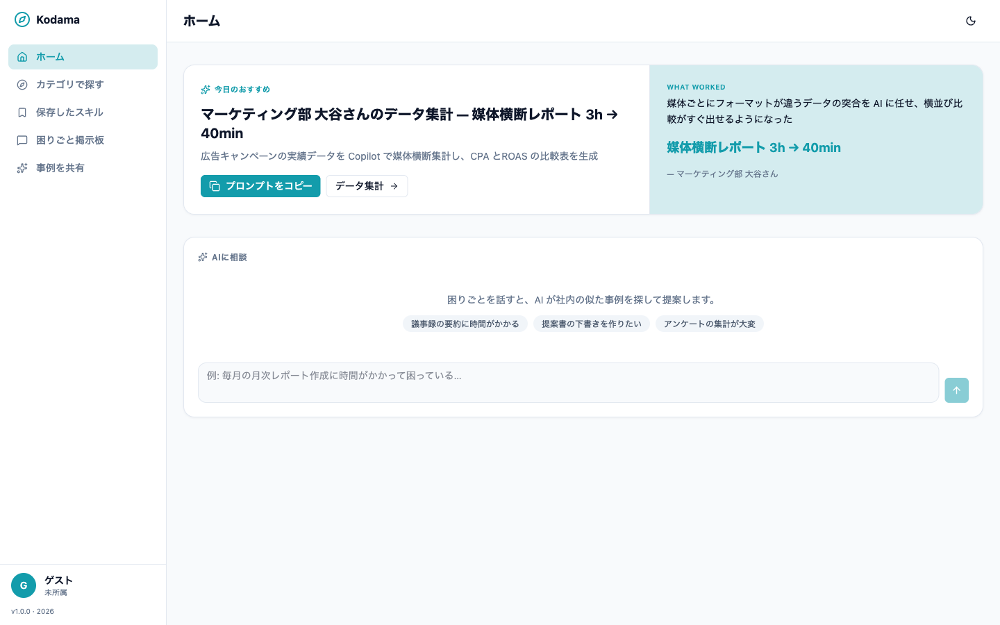
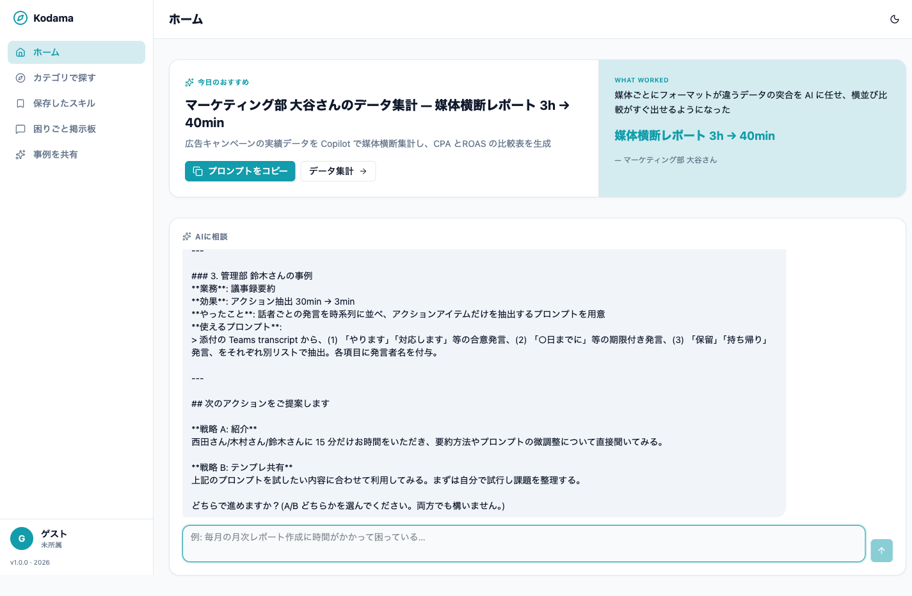
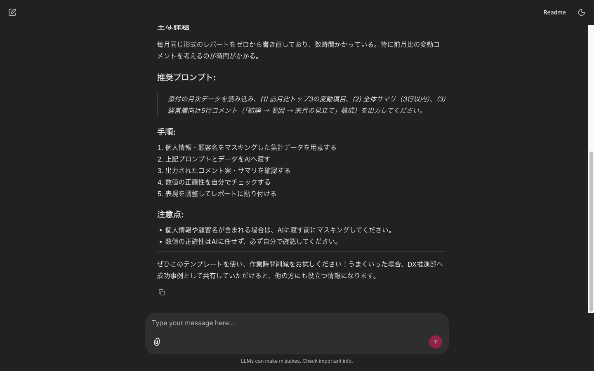
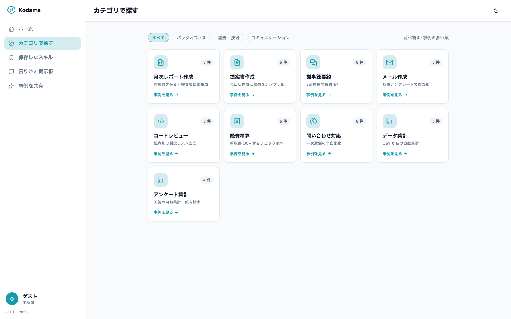
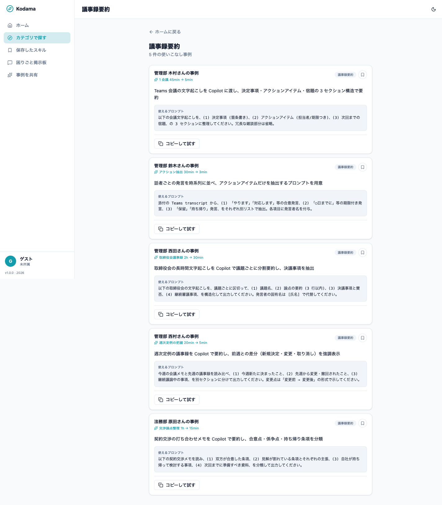
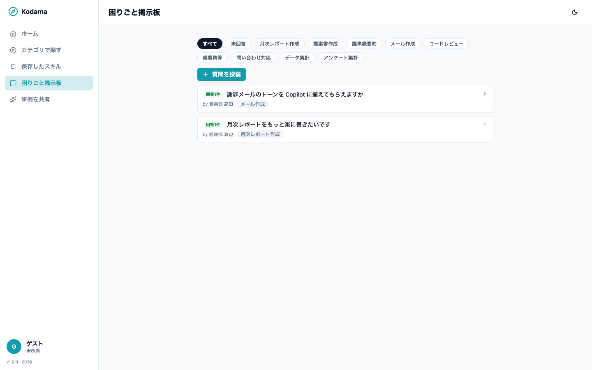
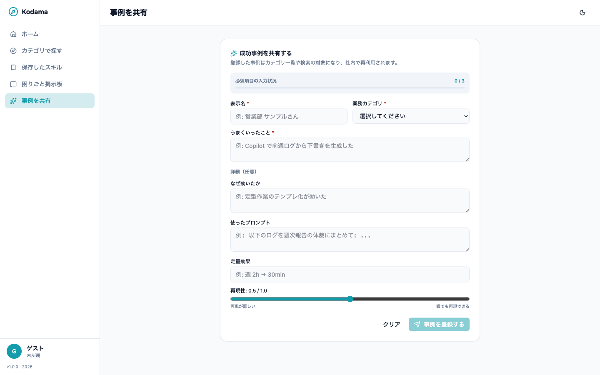
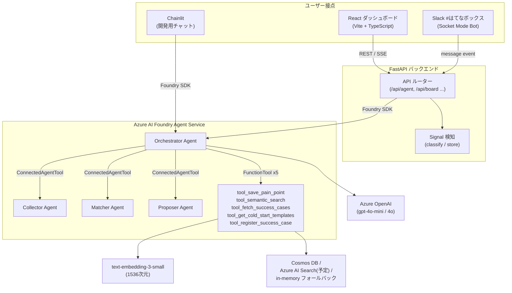
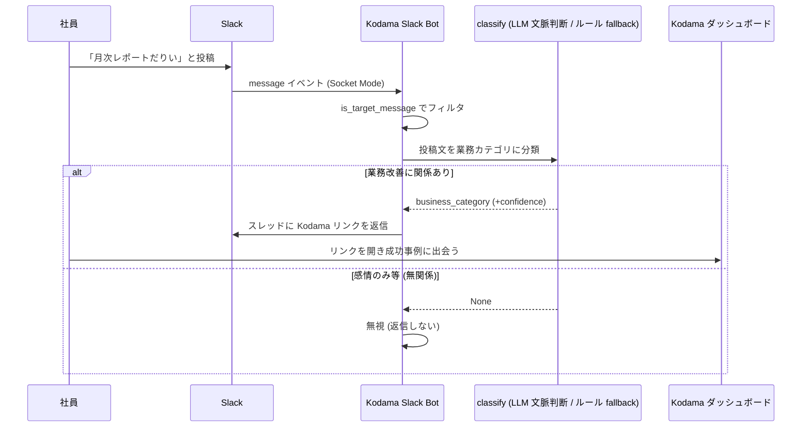

> **TL;DR**
> - 社内で AI 導入を推進する中で痛感した「**AI 活用格差**」——使う人だけが速くなり、使えない人が取り残される問題を解きたかった。
> - 答えは「**みんなが育てた AI**」。誰かの小さな成功事例を、困っている別の誰かに**シームレスに伝播**させる自律エージェント『**Kodama**』を作った。
> - **Azure AI Foundry Agent Service 上の 4 Agent 協調**＋**Azure OpenAI の文脈判断**で、「相談する人」だけでなく「**何を聞けばいいか分からない人**」にも Slack / Teams から能動的に歩み寄る設計。
> - Microsoft Agent Hackathon 2026 に向けて開発。この記事はその設計と実装の記録です。

## この記事でわかること

- 「AI 活用格差」という課題を、ツール導入ではなく**知見の伝播**で解こうとした思考プロセス
- Azure AI Foundry の **ConnectedAgentTool による 4 Agent オーケストレーション**の組み方
- 「決定論スコア × LLM 判断」「実 API 失敗時の決定論フォールバック」など、**落ちないエージェント**にするための実装判断
- Slack / Microsoft Teams への受動検知を**同一ロジック**で載せるアダプタ設計

---

# はじめに：「使える人だけが速くなる」現場のリアル

会社で Claude や Copilot の導入推進を担当しています。導入はした。でも、利用率は伸び悩んでいました。

- 使い方が分からない人は、**まったく使わない**
- 使いこなす人は、**どんどん業務を AI に置き換えていく**

この差——**AI 活用格差**を、私は毎日のように目の当たりにしていました。

格差が広がると何が起きるか。一部の人は AI で定時に帰り、残りの人は相変わらず手作業に追われます。**効率化のはずの AI が、かえって「働き具合」の差を広げてしまう。**

使い方をレクチャーしても、どれだけ効率化できるかを説いても、この溝は埋まりませんでした。

私が本当に変えたかったのは、生産性の数字そのものではありません。

> **特定の誰かではなく、誰もが AI を使いこなせる状態をつくり、組織全体の「働き具合」をよくすること。**

そのために、個人の中に閉じた「業務に対する AI の活用法」という暗黙知を、組織の形式知に変えて浸透させたい。その想いで Microsoft Agent Hackathon 2026 に向けて作ったのが、自律エージェント『**Kodama**』です。

---

# コンセプト：まっさらなAIより、みんなが育てたAIを

「自由にプロンプトを書いてください」——

まっさらな AI を渡されるのは、実は多くの人にとって心理的ハードルの高いお願いです。使いこなせる人はそれでいい。けれど「**何を書けばいいか分からない**」人を置き去りにする限り、AI 活用は一部の人のものであり続けます。

そこで Kodama が目指したのは、「**みんなが育てた AI**」です。

給湯室で交わされる「それ、こうやったらすぐ終わったよ」という何気ない立ち話。**あの自然な知見の共有に、システムでレバレッジをかける。** ゼロから AI の使い方を考えるのではなく、先輩や同僚が試行錯誤で見つけたコツを、ただなぞるだけでいい。

ねらいは、AI を使いこなす人を増やすこと**そのもの**です。一部の人の生産性をさらに伸ばすことではなく、

> **今まで使えなかった人が「自分にもできた」と一歩を踏み出せること。**

その小さな成功体験が積み重なれば、組織全体の働き具合は少しずつ底上げされていく。AI 活用の最初の一歩を、そっと後押しする。それが Kodama です。

---

# 作ったもの：Kodamaが提供する体験（デモシナリオ）

> **このセクションの要点**：Kodama は「聞かれたら答える」チャットボットではなく、「**その人の今の業務に刺さるものを、選ぶだけで使えるように提示する**」AI 活用提案エージェントです。

一般的なチャットボットと設計思想が少し違います。鍵は「**限りなくシームレスなマッチング**」。困っている人と成功事例の間にある摩擦を、とにかく削ることに振り切りました。

## ホーム：今日の成功事例と「AIに相談」

Kodama を開くと、まず **「今日のおすすめ」** が目に飛び込んできます。



「今日のおすすめ」は**日付をシードにしたアルゴリズム**で選ばれるので、同じ日にアクセスした社員はみんな同じ事例を見ます。「あ、今日トップに出てたあのプロンプト、使えそうだったね」という**共通の話題**を生むための仕掛けです。

その下にあるのが中心的な入り口、**「AIに相談」**。困りごとを自然な言葉で話すと、AI が社内の似た事例を探して提案します。入力に詰まらないよう、「議事録の要約に時間がかかる」といった相談例のチップも置いています。

### チャット中心に至るまでの試行錯誤

正直に書くと、最初のプロトタイプは Chainlit のシンプルなチャットでした。ところがテストすると——

**AI に不慣れな人ほど「チャットの窓に何を入力していいか分からない」** という壁にぶつかったのです。

一度は「ぽちぽち選ぶだけ」のダッシュボード型に振り切ることも考えました。が、選択肢を眺めるだけでは「自分の業務に引きつけた相談」までは届かない。最終的にたどり着いたのが、**2 つの入り口を併せ持つハイブリッド**です。

- **話せる人には、チャットで。** 「AIに相談」に困りごとを書けば、その文脈に最も近い事例が返る。
- **話せない人には、受動検知で。** 普段の Slack の何気ない投稿を Kodama が拾い、「それ、こうやると楽になりますよ」とそっと声をかける（後述の `#はてなボックス` 連携）。

「何を入力していいか分からない」層こそ、一番助けたい。その答えが、**相談を待つだけでなく Kodama 側から歩み寄る**設計でした。

### 「AIに相談」の実際

たとえば「議事録の要約に毎回30分以上かかっていて困っています」と相談すると、Kodama は社内の成功事例を**最大 3 件**提示し、続けて 2 つの次アクション（戦略 A / 戦略 B）を返します。



各事例には、次の情報がまとまっています。

- **誰の事例か**（例：管理部 西田さん）
- **何が変わったか**（例：取締役会議事録 2h → 30min）
- **今すぐ使えるプロンプト**（原文のまま引用）

そして締めくくりに必ず次の 2 択が出ます。

- **戦略 A：紹介** — 成功者に 15 分だけ時間をもらい、直接ノウハウを聞く
- **戦略 B：テンプレ共有** — 上記プロンプトを自分のペースで試す

ここで効いているのが、

- **提示は最大 3 件**
- **戦略 A / B を必ず両方出す**
- **社内 ID は絶対に表示せず、表示名で語る**

といった厳守ルール。これらは LLM に「覚えさせる」のではなく、後述する **Orchestrator の Instructions に直接書いて強制**しています。

### 成功事例がまだ無いとき（Cold Start）

社内にまだ近い事例が無い場合でも、Kodama は黙り込みません。業務カテゴリに合う「すぐ使える基本テンプレート」を提示し、「うまくいったら、このカテゴリの最初の成功事例として共有してください」と促します。



*（開発用の Chainlit UI で Cold Start の挙動を確認したもの）*

## カテゴリで探す

チャットだけでなく、業務カテゴリから探す動線も用意しています。「議事録要約」「月次レポート作成」といったカテゴリのグリッドから、紐づく成功事例をカード形式で一覧できます。



各カードには**プロンプトのワンクリックコピー**が付いており、気に入ったものは「保存したスキル」に残せます（履歴は localStorage に保持し、**サーバーには送りません**）。



## 困りごと掲示板

「わざわざ相談するほどでもないけど…」という小さな引っかかりの受け皿が **困りごと掲示板**。カテゴリで絞り込みながら、社内の困りごととその回答を眺められます。



## 事例を共有する

成功体験は 2 つのルートで蓄積できます。1 つは「AIに相談」の会話の中で Kodama が「これ、登録しておきますか？」と尋ねるルート。もう 1 つが、自分で書いて登録する **「事例を共有」** フォームです。



必須項目は「表示名」「業務カテゴリ」「うまくいったこと」の **3 つだけ**。プロンプトや定量効果は任意です。登録された事例はその場で検索対象に加わり、**翌日には同じ業務で困っている誰か**のもとへ届きます。

## Slack `#はてなボックス`：話せない人への受動的な導線

「チャットに何を書けばいいか分からない」人にこそ届けたい——その答えが Slack 連携です。

`#はてなボックス` チャンネルに「月次レポートだりい」のような何気ない投稿があると、Kodama の Slack Bot がそれを検知して業務カテゴリを推定し、スレッドにそっと返信します。

```
その"はてな"、月次レポート作成に近そうです。

近い成功事例とすぐ使えるプロンプトを見つけました👇
https://kodama.../categories/月次レポート作成?source=slack&signal_id=...
```

相談しようと身構えなくても、いつもの愚痴をこぼすだけで Kodama の方から歩み寄ってくる。これが Kodama のもう 1 つの入り口です。

---

# 技術構成：裏側で働く4つのAgent

> **このセクションの要点**：Kodama のバックエンドは **Azure AI Foundry Agent Service 上で動く 4 Agent の協調**。Orchestrator が窓口になり、3 つの子 Agent（収集・マッチング・提案）を文脈に応じて呼び分けます。

## アーキテクチャ全体像



## ① Orchestrator Agent：全体の指揮官

Orchestrator はユーザーと Kodama の **唯一の窓口**。チャット発話を解釈し、5 つの function tool と 3 つの子 Agent を適切に呼び分けます。

直接呼べる function tool は次の 5 つです。

| tool | 役割 |
| --- | --- |
| `tool_save_pain_point` | 本人承認済みの困りごとを永続化（チャット由来は `source_signal="chat_input"`） |
| `tool_semantic_search` | 困りごとテキストから類似成功事例を embedding 検索（`top_k ≤ 3`、`exclude_user_id` で本人除外） |
| `tool_fetch_success_cases` | 成功事例の詳細（表示名 / プロンプト / 定量効果）を取得 |
| `tool_get_cold_start_templates` | 事例 0 件のときに業務カテゴリ向けテンプレートを取得 |
| `tool_register_success_case` | 本人同意のもとで成功事例を登録し検索可能にする |

判断は Instructions に**入力パターンごとのルール**として明示しています。

- **パターン 1：本人が述べた困りごと**（「○○で困っている」）→ `tool_semantic_search` で関連事例を検索して提案。本人が同意した場合のみ `tool_save_pain_point` で保存
- **パターン 2：能動的な検索依頼**（「高橋さんに合う事例を探して」）→ `exclude_user_id` を設定して `tool_semantic_search`
- **パターン 3：一般的な質問・雑談** → tool 呼び出し不要で通常回答
- **パターン 4：成功体験の検知 → 登録提案**（「○○を AI でやったらうまくいった」）→ 不足項目を 1 つずつ確認し、本人同意のもとで `tool_register_success_case`（Human-in-the-Loop）

DX 推進担当者向けの「誰に何を届けるか」も、**専用の管理画面を作らずこのパターン 2 で実現**しています。「○○さんに合う事例を探して」と相談すれば、本人の事例を除外したうえで関連事例と戦略 A / B が返ってきます。

> **設計判断メモ**：初期構想にあった Microsoft Graph で組織活動を観測する「Observer Agent」は、ハッカソン MVP では Slack `#はてなボックス` の受動検知（Azure OpenAI の文脈判断、ルールベース fallback 付き）に置き換えました。Agent 構成も 5 → 4 にスリム化しています。

## ② Collector Agent：Human-in-the-Loopの守り人

Collector の仕事は **「データを保存してよいかどうかを確かめること」**。困りごとを構造化し、本人確認のメッセージ（「月次レポート作業でお困りですか？」）を生成し、**本人が同意した場合のみ**永続化します。

> **PII は user_id（内部 ID）のみを扱い、氏名・メールアドレスは DB に保存しません。** 表示が必要なときにのみ外部から解決する設計です。

## ③ Matcher Agent：決定論とLLMのハイブリッド

Matcher は「誰と誰を繋ぐか」を判断します。ポイントは **決定論でスコアを計算し、LLM で最終戦略を選ぶ**ハイブリッド構成です。

```python
final_score = (cosine_similarity * 0.7) + (reproducibility_score * 0.3) + business_type_bonus(0.2)
```

- **コサイン類似度（重み 0.7）**：困りごとテキストを text-embedding-3-small（1536 次元）でベクトル化し、成功事例との類似度を計算
- **再現可能性スコア（重み 0.3）**：その事例が他者でも再現できる可能性（0〜1）
- **業務種別ボーナス（+0.2）**：クエリに成功事例の `business_type` が含まれる場合に加算

embedding が未登録の場合は `business_type` / `what_worked` のテキストマッチへ**自動フォールバック**。本番（Azure AI Search）への切り替えも関数単位で差し替え可能な抽象化にしています。

## ④ Proposer Agent：文脈に合わせた提案の生成

Proposer は Matcher が選んだ事例を元に、依頼者向けメッセージをカスタマイズします。

- **戦略 A（紹介）**：成功者への依頼文を生成
- **戦略 B（テンプレ共有）**：成功者のプロンプトを**対象者の業務名にローカライズ**して生成

Instructions には「出典（表示名）を必ず示す」「押し付けず選択肢として提示する」という制約を書いています。

## Slack `#はてなボックス` 検知の仕組み

Slack 連携の入口（受信）は Foundry の Agent とは独立した **Socket Mode** で実装。公開 HTTP エンドポイント不要で動き、FastAPI の lifespan からバックグラウンド常駐します。



検知の核となる**分類は Azure OpenAI（`chat.completions`）の文脈判断**で行います。キーワード一致では取りこぼす言い回し（例「議事録まとめ直すの今日もか…」）も、**意味で**業務カテゴリを拾えるのが狙いです。感情のみ・雑談・業務無関係と判断した投稿には `none` を返させ、`None`（= 返信しない）として尊重します。

そして、クレデンシャル欠落や API 失敗・不正応答のときだけ、**決定論的なルールベース分類に fallback** し、オフライン / CI でも検知が止まらないようにしています（後述の embedding と同じフォールバック思想）。必要な Bot Token Scope は `channels:history` と `chat:write` の最小構成です。

> デモ用に `POST /api/slack/mock` も用意し、**Slack ワークスペースなしでも**検知フローを再現できます。

## Microsoft Teams への展開：Bot Framework アダプタ

`#はてなボックス` の受動検知は Slack 専用ではありません。同じ検知パイプラインを **Microsoft Teams** でも成立させる Bot Framework アダプタを実装しました。

Slack が Socket Mode（常駐接続）なのに対し、Teams は Azure Bot Service が発話を HTTP で push する方式です。

そこで messaging endpoint `POST /api/teams/messages` を 1 本用意しました。受け取った Bot Framework Activity を解釈して、**Slack と同じ `handle_message`（`source="teams"`）へ橋渡し**します。分類・URL 生成・保存はプラットフォーム共通で、**差分はアダプタ層だけに閉じ込めました**。

```python
# src/teams/adapter.py（要点）
def detect_from_activity(activity: dict, *, base_url: str) -> Signal | None:
    msg = extract_message(activity)        # message タイプ・本文あり・Bot 以外のみ
    if msg is None:
        return None
    return handle_message(                  # Slack とまったく同じ検知サービス
        channel_id=msg.conversation_id,
        slack_user_id=msg.user_id,
        text=msg.text,
        base_url=base_url,
        source="teams",                     # 検知元だけを差し替える
        ...,
    )
```

返信は Teams ネイティブな **Adaptive Card**（本文 +「Kodama で見る」ボタン）として組み立てて返します。同じ「困りごと → 該当カテゴリへ誘導」の体験を、Slack でも Teams でも同一ロジックで届けられます。

正直に書いておくと、**実際に Teams へメッセージが届くまで通すには Azure Bot Service への登録（App ID・公開エンドポイント）と Bot Framework JWT の検証が必要**です。そこはハッカソン MVP では未実装です。

ただし、アダプタと検知ロジックは単体・API テストで検証済み。Azure Bot を後付けすれば、本番 Teams 配信にそのまま載る設計にしています。

## 採用技術一覧

| 層 | 技術 | 役割 |
| --- | --- | --- |
| フロントエンド | React + Vite + TypeScript + Tailwind CSS | Web ダッシュボード |
| バックエンド API | FastAPI | エンドポイント提供・Agent 呼び出し・SSE ストリーミング |
| 開発用チャット | Chainlit | Orchestrator の動作確認用 UI |
| Agent 基盤 | Azure AI Foundry Agent Service | Multi-Agent Orchestration |
| LLM | Azure OpenAI（gpt-4o-mini / gpt-4o） | 全 Agent 共通の推論エンジン |
| Embedding | text-embedding-3-small（1536 次元） | 類似事例のセマンティック検索 |
| データ | Azure Cosmos DB | 成功事例・困りごとの永続化 |
| 検索 | Azure AI Search（予定）/ in-memory フォールバック | ベクトル検索 |
| インフラ | Azure Container Apps | スケールアウト・公開 URL（scale-to-zero） |
| 認証 | Microsoft Entra ID + Managed Identity | ローカル〜本番でコード変更なし |
| 外部連携（Slack） | Slack（Socket Mode / Bolt） | `#はてなボックス` の受動検知 |
| 外部連携（Teams） | Microsoft Teams（Bot Framework Activity / Adaptive Card） | 同じ検知を Teams でも受信・返信 |

---

# 実装で工夫したポイント

**① ConnectedAgentTool で子 Agent を「必要なときだけ」呼ぶ**

Orchestrator は基本を function tool で完結させ、判断が難しいときだけ子 Agent に委譲します。**LLM のコール数（コストとレイテンシ）を抑えつつ、複雑なケースへの対応力を残す**バランスを狙いました。

**② embedding は lazy load で、失敗してもサービスを止めない**

FastAPI の起動時に成功事例の embedding を一括登録します。Azure OpenAI の呼び出しが失敗しても、embedding なしで全件再ロードしてサービスを継続。検索はベクトル検索からテキストマッチへ透過的にフォールバックします。

さらに **Azure クライアントには短い timeout を設定**し、回線断時も既定の長いリトライで待たされず素早く fallback に切り替わるようにしました。

**③ 履歴はサーバーに送らず localStorage に留める（MVP段階）**

「保存したスキル」やコピー履歴はブラウザの localStorage に留めています。集計基盤を先に作るより、まずは「**プレッシャーなく使われる体験**」を優先したかったからです。

**④ DefaultAzureCredential で認証コードを変えない**

ローカルでは `az login` の認証情報、Azure Container Apps では Managed Identity を自動で使い分けます。環境ごとに認証コードを書き替える必要も、シークレットを環境変数に晒す必要もありません。

---

# 今後の展望とおわりに

AI は魔法ではありません。強力なツールを導入したからといって、翌月に全員の業務が変わるわけではない。

AI 導入で本当に必要なのは、**現場の誰かが生み出した「小さな工夫」をこぼさずにすくいあげること。そして、それを組織の中に伝播させていく仕組み**です。

Kodama が目指すのは、こんな循環が当たり前に回る世界です。

1. 誰かが AI で、面倒な作業の時間を削減する。
2. Kodama がそれを静かに検知し、「これ、みんなにも共有していいですか？」と尋ねる。
3. うなずけば、新しい知恵として蓄積される。
4. 翌日、同じ業務で頭を抱えている別の誰かのもとへ、その知見が届く。

今回のハッカソンでは、「手動登録＋セマンティック検索からの提案」に加え、**Slack と Microsoft Teams（Bot Framework）の両チャネルからの受動的な困りごと検知**までを MVP として実装しました。今後は Microsoft Graph を通じたより広範な自動検知や、Power Automate 連携まで広げていく予定です。

「孤独な AI 活用」を終わらせるために作った、AI 活用浸透エージェント『Kodama』。誰かの小さな成功体験が、木霊のように、次の誰かのもとへ飛んでいく。そんな温かいエージェントを、これからも作り続けたいと思います。
